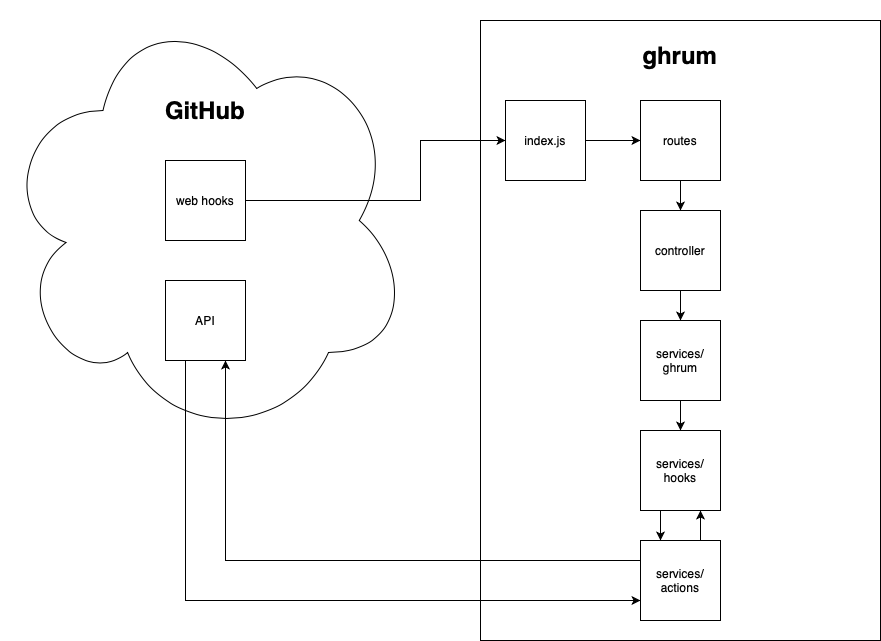

# ghrum

Enhances GitHub issues for scrum project management.

Was close to being complete. The new Github projects feature killed the need for this. Dang!

[Features](#features)

[Deployment](#deployment)

[Contributing](#contributing)

# Features

TODO:

# Deployment

TODO:

# Contributing

[Project Overview](#project-overview)

[Local Development Setup](#local-development-setup)

## Project Overview

TODO:

## Local Development Setup

### Create Local Copy of Project

TODO:

### smee

TODO:

### Create Github App

TODO:

step about creating app in profile
set proper webhook actions
give app proper permissions
generate private key

### Configure Local App

TODO:
configure launch.json with variables configured above
download private key and store somewhere

### Create Github Repository for Testing

TODO:
create repo that will be used to send events to your local instance of ghrum

### Run App

In a separate terminal, run command `./node_modules/.bin/smee -u <SMEE_URL>`, replacing `<SMEE_URL>` with the URL you generated with smee.io.

Once smee is running ghrum can be run through the visual studio code debugger.